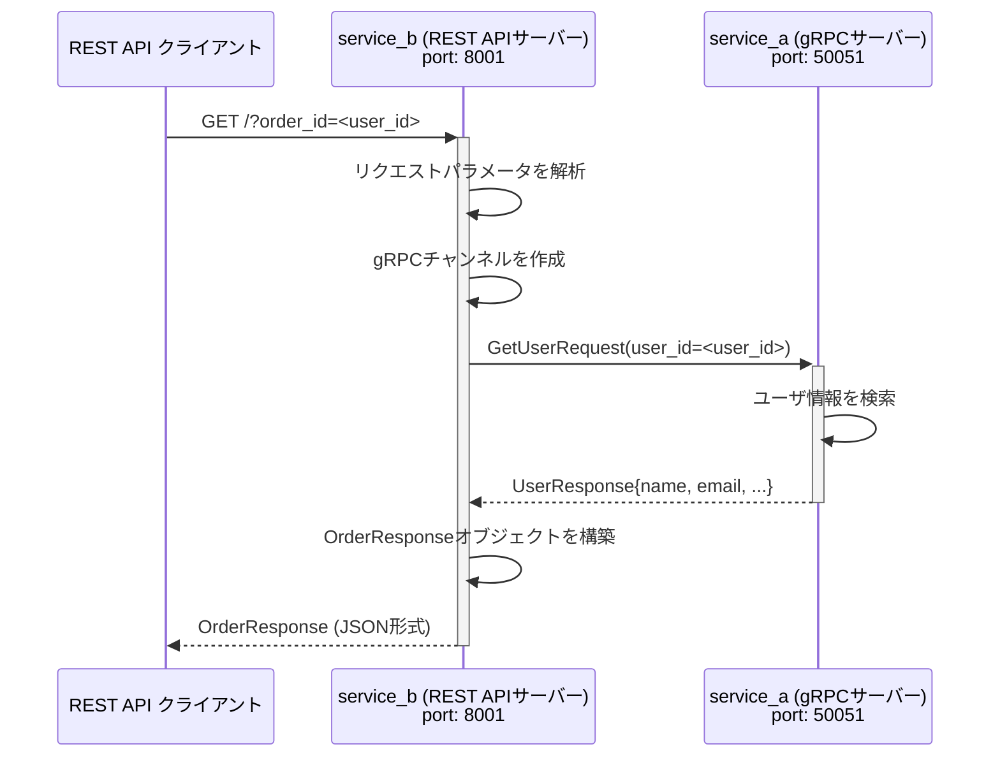

# django-ninja-to-grpc-migration-example

このリポジトリは、Django と gRPC を組み合わせた実装例として作成された、ふたつのサービスを含むモノレポです。

- **service_a**
  - Django を基盤とし、gRPC サーバーを起動してユーザー情報を返却するサービス
- **service_b**
  - Django Ninja を利用した REST API サーバー。ユーザー情報の取得時に、`service_a` の gRPC エンドポイントを呼び出します。

本プロジェクトを通じて、Django ベースの gRPC サーバーと Django Ninja の REST API を連携させるサンプルを確認できます。

## セットアップ

### 依存パッケージ

- Python 3.13
- uv
- docker / docker-compose
- cargo-make (makers)

### proto ファイル・スタブ生成

- service_a / service_b それぞれのディレクトリで自動生成する仕組み（`Makefile.toml` の `gen-proto` タスク）を用意しています。
  - `Makefile.toml` の `run-in-docker` タスクを実行すると、事前処理として proto ファイルからスタブコードが自動生成されるので、手動で生成する必要はありません。

## 実行方法

### 全サービスを一括起動する

- ルートディレクトリで `./run.sh` を実行すると 2 つのサービスコンテナがすべて起動します

  ```bash
  chmod +x run.sh
  ./run.sh
  ```

- service_a
  - Django -> 8000 ポート
  - gRPC サーバー -> 50051 ポート
- service_b
  - Django -> 8001 ポート

### 動作イメージ



1. REST API クライアントが service_b に対して GET /?order_id=<user_id> リクエストを投げる
2. service_b 内部で gRPC チャンネルを作成し、service_a に GetUserRequest(user_id=<user_id>) を送信
3. service_a （gRPC サーバー）がユーザ情報を返却
4. service_b が結果を受け取り、OrderResponse として REST API クライアントに返す

## アクセス方法

各コンテナを起動後、http://localhost:8001/api/docs （サービス B の get /api/orders）にアクセスし、Swagger UI からリクエストを投げるとレスポンスが返却されます。
